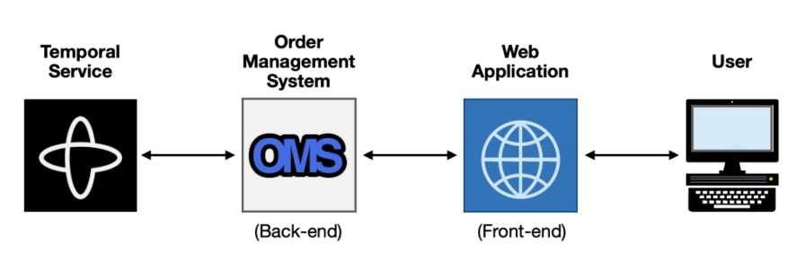
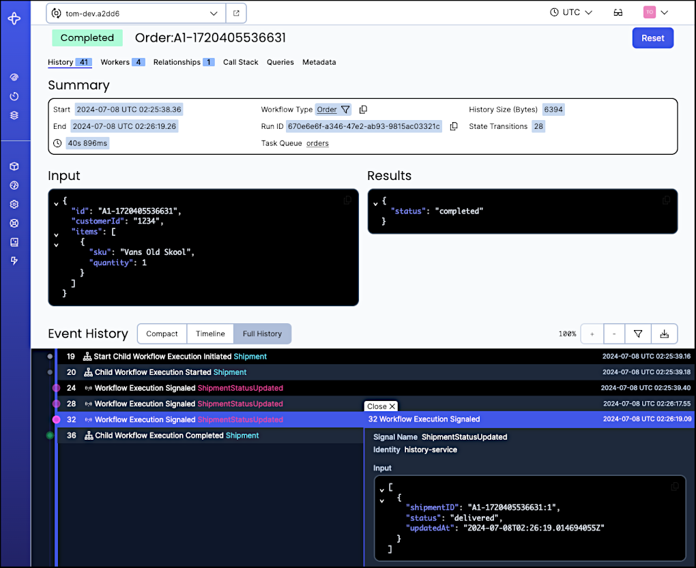

# About the Order Management System 

The Order Management System (OMS) reference application illustrates a
common use case for Temporal: processing product orders from customers.

## OMS Overview

An OMS is inherently a back-end system, but we provide a basic web
application that offers a convenient way to interact with it. It is 
also possible to interact with it using APIs provided by the OMS or 
through the `temporal` command-line tool.

The following diagram illustrates the high-level interaction that
takes place when a user submits an order through the web application:

Notice that each item is only connected to the items adjacent to it.
The user does not interact with either the OMS or the Temporal
Service. Likewise, the web application does not use any Temporal
libraries or tools; it only calls APIs provided by the OMS. This
design increases both security and flexibility.

## Order Processing Overview
The input to the OMS is an order, which has a unique identifier, is 
associated with a customer, and specifies a list of SKUs (products) 
along with the quantities.

Upon receiving an order, the OMS launches a Workflow to orchestrate 
all of the steps required to process it. This includes claiming the 
items from inventory, generating invoices and charging the customer 
for each shipment, and booking couriers who pick them up from the
warehouse and deliver them to the customers. This Workflow ends when
all shipments have been delivered or when canceled by the business or 
customer.

## Benefits of Using the Temporal Platform

### Reliability
The application gains reliability from the support provided by the 
Temporal Service, which automatically manages application state and 
allows the system to withstand failure conditions. Once the OMS 
receives an order, that order will be processed, no matter what.

If the application makes a call to a microservice that’s experiencing
an outage, for example, that call will be retried according to a
configurable policy. When the microservice comes back online, the call
will succeed on the next retry attempt and further processing will
follow.

If the application terminates unexpectedly while processing is
underway, the application can automatically reconstruct the
pre-termination state and resume where it left off, as if the problem
never happened at all. You can even resume that execution on another
machine, which allows the application to overcome hardware failures.

### Scalability
You can increase throughput—enabling the system to handle more orders 
concurrently—by running additional instances of the application. 
Although Temporal applications can run on bare metal or virtual 
machines, many users deploy them in containers managed through 
Kubernetes, and use metrics provided by the Temporal Service to 
scale them up or down in response to changing demand.

### Availability
Each additional instance contributes to the application's
availability. If one of those instances crashes, another running
instance will automatically take over processing from where the
previous one left off.

Any instance can automatically take over processing for one that fails
(for example, due to a hardware crash).

### Developer Productivity
Although often initially overlooked, developers who begin using 
Temporal soon realize that they're much more productive. They 
spend less time writing code to handle failure scenarios, which 
frees them up to focus on the business logic and ship features 
faster.

The productivity boost is also evident in production. The Temporal  
Service maintains a complete Event History for every execution. Its 
corresponding Web UI provides a convenient way to view the timeline 
and details of these Events, both for orders in progress as well as 
those that have already completed. The result is immediate insight 
into the status of every order processed.

In fact, a developer can download the Event History for any execution 
and replay it in a debugger, making it possible to [reproduce and fix
elusive bugs](https://www.youtube.com/watch?v=fN5bIL7wc5M) in your
application code. And once it is fixed, you can use that history file 
in an automated test and be confident that there are no regressions.
