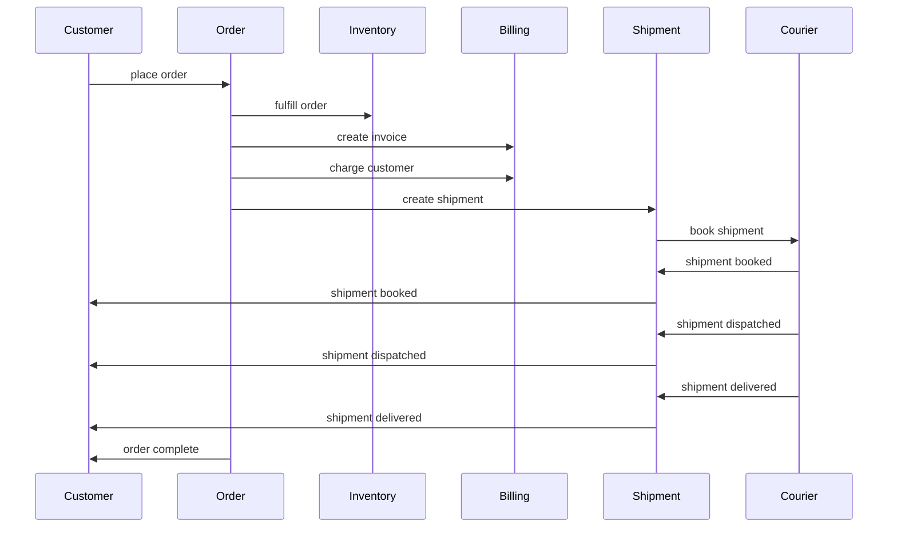
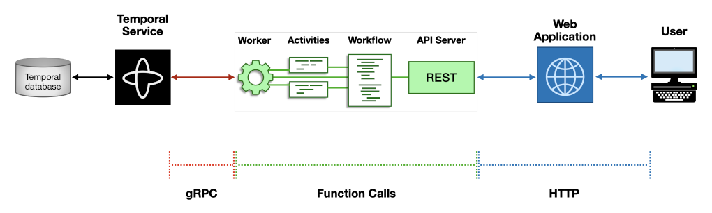
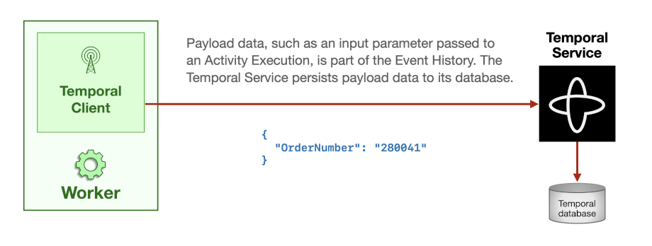
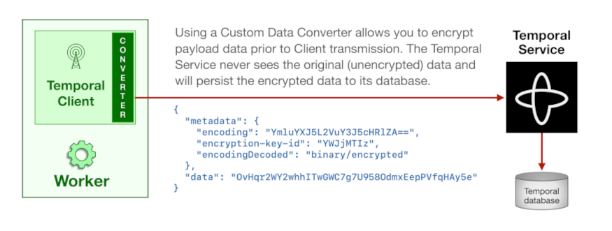

# Order Management System (Go) - Technical Description

## Introduction

### Terminology

Understanding the following terms will help you to better understand the
design and implementation of the OMS.

<dl>
  <dt>Order</dt> <dd>
    An order represents the set of products that the customer wishes to
    purchase. It is provided as input to the OMS, which then
    orchestrates all the steps required to process the order, which
    begins by reserving them from inventory and ends with delivering
    them to the customer. In terms of data structure, an order has a
    unique identifier, is associated with a specific customer, and
    references one or more SKUs (products) along with the requested
    quantity of each.
  </dd>

  <dt>Item</dt> <dd>
    An item is a single instance of a given product. For example, an
    order that requests three pairs of the same shoes has a single
    product but three items.
  </dd>

  <dt>Fulfillment </dt> <dd>
    An order may be fulfilled by providing all of the requested items
    together or by dividing them into subsets, typically based on
    location and availability. These subsets are known as fulfillments.
    As with many OMS implementations, this system charges the customer
    for each fulfillment individually instead of placing a single charge
    for the entire order.
  </dd>

  <dt>Courier</dt> <dd>
     This can refer to the organization that manages a fleet of delivery
     vehicles and drivers or to an individual driver.  In either case,
     the courier is responsible for delivering items to the customer who
     requested them.
  </dd>

  <dt>Shipment</dt> <dd>
    This is effectively the same as a fulfillment, but conveys a
    physical grouping instead of a logical one. The fulfillment becomes
    a shipment in the warehouse where the items are picked from
    inventory and packed for delivery. The shipment is then handed off
    to a courier, who delivers it to the customer.
  </dd>

</dl>

### Non-Goals

#### Product Database 
Processing begins when an order is submitted to
the OMS. That input contains a list of products (SKUs), but the OMS
requires no knowledge of those products to process the order. Thus, the
product database is external to the OMS and only minimally implemented
in the web application to provide a means of submitting the order.

There is one exception. While this OMS can be used to process orders for
any type of product, we had to choose some type of product in order to
demonstrate it. We selected shoes. Except for a few lines of code in
[the ReserveItems
Activity](https://github.com/temporalio/reference-app-orders-go/blob/4546fb2a41cacd84bd4158728808aa74cd188e8f/app/order/activities.go#L83-L89),
which always marks Adidas shoes as being out of stock for demonstration
purposes, the application is agnostic to the details of the products
being ordered.

#### Shopping Cart
The OMS web application does not provide a typical e-commerce shopping 
cart for creating a list of items to purchase by choosing individual 
products. This is considered external to the OMS.

For demonstration purposes, the web application populates a set of 20 
orders, each of which is essentially a pre-filled shopping cart. Order 
#1 always contains a single in-stock item, while the other orders are 
randomly generated. Submitting one of them is equivalent to completing 
the checkout process in a typical e-commerce website; this step supplies 
the order to the OMS, which begins processing it.

#### Product Inventory 
Finally, the OMS does not implement or integrate with a real system for 
managing product inventory. The aforementioned `ReserveItems` Activity 
serves to illustrate where the OMS would connect to such a system, but 
this application simulates its behavior with logic that determines 
whether a product is in stock based on its brand name.

## System Design and Implementation
The OMS is composed of three subsystems, which provide Workflows,
Activities, and Workers capable of running them. They also provide a
REST API that enables the web application to create new orders, view the
status of existing orders, and manage shipments related to those orders.

#### Order Processing
The Order subsystem manages the overall processing of an order. When the
web application posts to the Order API's [endpoint for creating an
order](https://github.com/temporalio/reference-app-orders-go/blob/5e0e5bc56fe43862052a76316f8ee311badbe678/app/order/api.go#L209),
the [function that handles this
request](https://github.com/temporalio/reference-app-orders-go/blob/5e0e5bc56fe43862052a76316f8ee311badbe678/app/order/api.go#L237-L278)
starts the [Order
Workflow](https://github.com/temporalio/reference-app-orders-go/blob/5e0e5bc56fe43862052a76316f8ee311badbe678/app/order/workflows.go#L26-L34),
which in turn creates a set of fulfillments and calls the [ReserveItems
Activity](https://github.com/temporalio/reference-app-orders-go/blob/5e0e5bc56fe43862052a76316f8ee311badbe678/app/order/activities.go#L70-L126)
to claim the requested items from the warehouse.

#### Customer Interaction
If an item in one of those fulfillments is unavailable, the Workflow
will wait for [customer
interaction](https://github.com/temporalio/reference-app-orders-go/blob/5e0e5bc56fe43862052a76316f8ee311badbe678/app/order/workflows.go#L74-L98),
either accepting an amended order that excludes the unavailable item or
canceling the order altogether. This interaction is delivered to the
Workflow through a Signal, although the Workflow also [sets a
Timer](https://github.com/temporalio/reference-app-orders-go/blob/5e0e5bc56fe43862052a76316f8ee311badbe678/app/order/workflows.go#L228-L241)
and will cancel the order if no Signal was received within [a predefined
time
limit](https://github.com/temporalio/reference-app-orders-go/blob/5e0e5bc56fe43862052a76316f8ee311badbe678/app/order/workflows.go#L22-L23).
In any case, it [updates the order
status](https://github.com/temporalio/reference-app-orders-go/blob/5e0e5bc56fe43862052a76316f8ee311badbe678/app/order/workflows.go#L128-L140).
This ultimately results in a call to the Order API, which [updates the
order
status](https://github.com/temporalio/reference-app-orders-go/blob/5e0e5bc56fe43862052a76316f8ee311badbe678/app/order/api.go#L321)
in a cache (the record was inserted earlier by the endpoint handler
function that started the Order Workflow).

#### Application Cache
Although the Order API will [Query the Order
Workflow](https://github.com/temporalio/reference-app-orders-go/blob/5e0e5bc56fe43862052a76316f8ee311badbe678/app/order/workflows.go#L58-L65)
for the status of a _specific_ order based on its Workflow ID, it must
also provide a list of _all_ orders and their status values to the web
application. The cache used by the Order API provides that capability
(using [Custom Search
Attributes](https://docs.temporal.io/visibility#custom-search-attributes)
is not appropriate for this due to their eventual consistency). This
cache is implemented using a SQLite database for the sake of simplicity,
but we recognize that it's a likely bottleneck. For a production system,
you would likely replace this SQLite-based implementation with something 
that can support your expected load.

#### Billing System
As it [processes each
fulfillment](https://github.com/temporalio/reference-app-orders-go/blob/5e0e5bc56fe43862052a76316f8ee311badbe678/app/order/workflows.go#L333-L350),
the system uses a [Side
Effect](https://docs.temporal.io/workflows#side-effect) to generate a
UUID that's used as an idempotency key by the [Charge
Activity](https://github.com/temporalio/reference-app-orders-go/blob/5e0e5bc56fe43862052a76316f8ee311badbe678/app/order/workflows.go#L333-L350).
That Activity makes a [request to the Billing
API](https://github.com/temporalio/reference-app-orders-go/blob/5e0e5bc56fe43862052a76316f8ee311badbe678/app/order/activities.go#L134-L167),
and the [handler for the
endpoint](https://github.com/temporalio/reference-app-orders-go/blob/5e0e5bc56fe43862052a76316f8ee311badbe678/app/billing/api.go#L102-L143)
that it calls starts a new Workflow to [orchestrate steps related to the
Charge](https://github.com/temporalio/reference-app-orders-go/blob/5e0e5bc56fe43862052a76316f8ee311badbe678/app/billing/workflows.go#L9-L56).

The reason that the Activity code makes a request to the API endpoint,
rather than starting the Charge Workflow directly, is because we wanted
the ability to run the Billing subsystem in a separate Namespace to
illustrate a service managed by a different team. Temporal does not
currently support cross-Namespace calls, and while the [Nexus
project](https://github.com/temporalio/proposals/blob/master/nexus/problem-statements.md)
will provide a solution for this in the future, this code demonstrates
an approach that a developer can use in the meantime.

The Charge Workflow executes an Activity to [generate an
invoice](https://github.com/temporalio/reference-app-orders-go/blob/5e0e5bc56fe43862052a76316f8ee311badbe678/app/billing/activities.go#L24-L56)
for the fulfillment, which is shown on the detail page for the order in
the web application. Since the implementation of a product database is
outside the scope of the OMS, this Activity simulates that integration
by generating random prices (within a realistic range) for each SKU as
well as the fulfillment's shipping cost. Next, the Charge Workflow
executes an Activity to [charge the customer's payment
card](https://github.com/temporalio/reference-app-orders-go/blob/5e0e5bc56fe43862052a76316f8ee311badbe678/app/billing/activities.go#L114-L135),
which begins with a [call to the Fraud
API](https://github.com/temporalio/reference-app-orders-go/blob/5e0e5bc56fe43862052a76316f8ee311badbe678/app/billing/activities.go#L75-L112).

#### Fraud Detection
The fraud detection service evaluates the charge based on the specific
customer and purchase amount (as further described in the [OMS product
requirements documentation](product-requirements.md)). The Activity
delivers the result of this call back to the Charge Workflow, which ends
as "Completed" since it has completed all of its steps. The Workflow
processing this fulfillment then [checks the
value](https://github.com/temporalio/reference-app-orders-go/blob/5e0e5bc56fe43862052a76316f8ee311badbe678/app/order/workflows.go#L362-L366)
returned by the Charge Workflow. If the payment was declined, the
fulfillment is marked as failed, and processing will continue with any
remaining fulfillments in the order.

If the payment was approved, processing will continue by [creating a
shipment](https://github.com/temporalio/reference-app-orders-go/blob/5e0e5bc56fe43862052a76316f8ee311badbe678/app/order/workflows.go#L307-L310)
for the fulfillment. This is done by [executing a Child
Workflow](https://github.com/temporalio/reference-app-orders-go/blob/5e0e5bc56fe43862052a76316f8ee311badbe678/app/order/workflows.go#L392-L400) 
that will orchestrate the steps required to [book a
courier](https://github.com/temporalio/reference-app-orders-go/blob/4546fb2a41cacd84bd4158728808aa74cd188e8f/app/shipment/workflows.go#L101-L110)
and update the status following each interaction with them. As with the
customer interaction that occurs when a requested item is unavailable,
information about courier interactions are [delivered to the
Workflow](https://github.com/temporalio/reference-app-orders-go/blob/4546fb2a41cacd84bd4158728808aa74cd188e8f/app/shipment/workflows.go#L121-L132)
using Signals, a common way of handling human-in-the-loop scenarios.

#### Shipment Processing
Similar to the Order Workflow, the Shipment Workflow [defines a Query
handler](https://github.com/temporalio/reference-app-orders-go/blob/4546fb2a41cacd84bd4158728808aa74cd188e8f/app/shipment/workflows.go#L82-L89),
which allows on-demand access to the status of a Shipment, given the
Workflow ID associated with it. The Shipment API [uses it to provide
status
information](https://github.com/temporalio/reference-app-orders-go/blob/4546fb2a41cacd84bd4158728808aa74cd188e8f/app/shipment/api.go#L120-L123)
to the web application.

In addition to [receiving
Signals](https://github.com/temporalio/reference-app-orders-go/blob/4546fb2a41cacd84bd4158728808aa74cd188e8f/app/shipment/api.go#L173-L198)
from the API server when the courier is dispatched or delivers a
shipment, the Shipment Workflow also [sends status update Signals](https://github.com/temporalio/reference-app-orders-go/blob/4546fb2a41cacd84bd4158728808aa74cd188e8f/app/shipment/workflows.go#L153-L163)
to the Order Workflow.

The Shipment Workflow ends when the courier delivers the package to the
customer. The Order Workflow, which has been [tracking status updates
for each shipment](https://github.com/temporalio/reference-app-orders-go/blob/4546fb2a41cacd84bd4158728808aa74cd188e8f/app/order/workflows.go#L95-L112),
completes once the final shipment in the order has been delivered.

### Sequence Diagram

The following sequence diagram illustrates the interaction between the 
users and subsystems in the OMS.

### Data Model 

As described above, the Order and Shipment API servers use a cache so 
they can quickly provide a list of orders and shipments, along with
corresponding status information. This is implemented with a SQLite 
database, shared by both services, with each service exclusively using 
a single table in that database. The [schema for this
database](https://github.com/temporalio/reference-app-orders-go/blob/5e0e5bc56fe43862052a76316f8ee311badbe678/app/server/schema.sql) is stored in the `app/server/` 
directory. The `server.go` file in that directory provides [the SetupDB
function](https://github.com/temporalio/reference-app-orders-go/blob/5e0e5bc56fe43862052a76316f8ee311badbe678/app/server/server.go#L74-L82)
that creates this database (if not already present). The `SetupDB`
function is called when [starting the Order or Shipment API
servers](https://github.com/temporalio/reference-app-orders-go/blob/5e0e5bc56fe43862052a76316f8ee311badbe678/app/server/server.go#L173-L193).

### Protection of Confidential Data 
Order processing may involve the use of confidential data, such as 
credit card numbers. In some cases, the combination of SKUs and 
customer information is considered sensitive information, as might 
be the case for a pharmacy or medical supply company.

Communication across this entire system involves multiple paths and
protocols, as illustrated in the following diagram:

The user's browser communicates with the web application over HTTP. The
web application also uses HTTP to access the API server. Data passing
through these links could be protected from eavesdroppers through the
use of TLS.

Much of the communication within the application code happens through
direct function calls. When it involves interaction with the Temporal
Service (such as executing a Workflow or Activity, sending a Signal, or
making a Query), it takes place over gRPC. As with HTTP, gRPC
communication can be secured through TLS, but this is optional for a
self-hosted deployment of the Temporal Service. Temporal Cloud mandates
the use of TLS with mutual authentication, or mTLS, which requires a
certificate for both client and server.

As a Worker executes Workflow and Activity functions, it uses a Temporal
Client to communicate with the Temporal Service. Data passed as input
to—or returned as output from—a Workflow or Activity is part of the
Event History for the Workflow Execution and is transmitted to the
Temporal Service, when then durably persists this information to its
database.

TLS does not protect the confidentiality of this data at rest, so
someone who can gain access to the database would have the ability to
view this data. To protect against this threat, Temporal Clients support
the use of a [Custom Data
Converter](https://docs.temporal.io/dataconversion#custom-data-converter),
which transforms these payloads as they pass through a Client. Custom
Data Converters are commonly used to implement encryption.

The OMS [implements a Custom Data
Converter](https://github.com/temporalio/reference-app-orders-go/blob/4546fb2a41cacd84bd4158728808aa74cd188e8f/app/util/data_converter.go),
which uses the AES cipher to encrypt the data. Instead of hardcoding an
encryption key directly or passing it through an environment variable,
this implementation [defines a
function](https://github.com/temporalio/reference-app-orders-go/blob/4546fb2a41cacd84bd4158728808aa74cd188e8f/app/util/data_converter.go#L27-L39)
that retrieves a key with a given identifier, simulating the use of a
key management server. The [Encode
function](https://github.com/temporalio/reference-app-orders-go/blob/4546fb2a41cacd84bd4158728808aa74cd188e8f/app/util/data_converter.go#L53-L82)
retrieves the key and uses it to encrypt the payload data, while the
corresponding [Decode
function](https://github.com/temporalio/reference-app-orders-go/blob/4546fb2a41cacd84bd4158728808aa74cd188e8f/app/util/data_converter.go#L84-L121)
decrypts the payload.

To enable the Custom Data Converter, use the `--encryption-key-id`
option in the command used to start the Worker and API servers. Since
this implementation simulates key lookup and does not rely on an actual
key management server for retrieval, you can use any string as an
argument to that option. Using the Custom Data Converter results in the
encryption of all payloads, which means that you will no longer be able
to view this information when using the `temporal` CLI or the Temporal
Web UI. However, the OMS also provides a [Codec
Server](https://docs.temporal.io/production-deployment/data-encryption)
implementation, which you can run by executing `go run ./cmd/oms
codec-server --url http://localhost:8080` (assuming the Temporal Web UI
is running locally on port 8080). You can then configure the `temporal`
CLI and Temporal Web UI to use this Codec Server, after which it will
transparently decrypt this payload information for you to view.

### Tests 
The OMS codebase provides unit tests for individual Workflows
([example](https://github.com/temporalio/reference-app-orders-go/blob/4546fb2a41cacd84bd4158728808aa74cd188e8f/app/order/workflows_test.go))
and Activities
([example](https://github.com/temporalio/reference-app-orders-go/blob/4546fb2a41cacd84bd4158728808aa74cd188e8f/app/order/activities_test.go)),
plus an [end-to-end functional
test](https://github.com/temporalio/reference-app-orders-go/blob/4546fb2a41cacd84bd4158728808aa74cd188e8f/app/test/order_test.go).
A
[Makefile](https://github.com/temporalio/reference-app-orders-go/blob/4546fb2a41cacd84bd4158728808aa74cd188e8f/Makefile)
in the project root provides a convenient way to run these tests and
generate a coverage report.

### CI/CD 
This repository provides [configuration files 
that enable CI/CD automation](https://github.com/temporalio/reference-app-orders-go/tree/main/.github/workflows)
through GitHub Actions:

* The Action [defined in `lint.yml`](https://github.com/temporalio/reference-app-orders-go/blob/main/.github/workflows/lint.yml)
runs the [Revive](https://revive.run) linter for Go, which helps us to
maintain a high-quality codebase.  
* The Action [defined in `build-and-test.yml`](https://github.com/temporalio/reference-app-orders-go/blob/main/.github/workflows/build-and-test.yml)
runs the automated tests and builds the application binary on several
platforms, which helps us to ensure that the application works correctly
regardless of whether it's running on Linux, macOS, or Windows.  
* The Action [defined in `docker-publish.yml`](https://github.com/temporalio/reference-app-orders-go/blob/main/.github/workflows/docker-publish.yml)
file builds three Docker images and publishes them to a container
registry. The first image contains the Worker, the second contains the
API server, and the third contains the Codec Server.

### Target Environments

This OMS is designed with multiple target environments in mind.

For development purposes, it is convenient to run everything locally.
This includes the OMS itself (Workers, API Servers, and the Codec Server
[if using this feature]), as well as the OMS demo web application and
Temporal Service (launched from the `temporal` CLI or Docker Compose).

It is also possible to use a Temporal Service running elsewhere, whether
that's provided by your self-hosted deployment of the Temporal Server
software or through our fully-managed [Temporal Cloud](https://temporal.io/cloud) 
offering. Enabling does not require you to modify the application code. 
You just need to [set one or more environment variables](https://github.com/temporalio/reference-app-orders-go/blob/main/app/server/server.go#L30-L33) 
when you start the Workers and API servers.

Similarly, you can distribute the Workers and API servers across
multiple machines. You can run each of them as executables directly on
the server ("bare metal"), inside virtual machines, or in containers.
This project also provides [instructions for Kubernetes deployment](deploy-on-k8s.md).

### Limitations

As previously noted, the cache used by the Order and Shipment subsystems
is implemented with a SQLite database. This was done for simplicity, to
minimize setup for demonstrations, and to avoid implying that we endorse
a specific vendor. For production use, we very strongly recommend
replacing this SQLite-based implementation with one that can support
your expected load.

When using the `temporal server start-dev` command to launch a Temporal
Service for local development, keep in mind that it uses an in
memory-database by default. If the service is restarted, the histories
of previous Workflow Executions are lost. Since the cache used by the
Order and Shipment APIs is maintained on disk (in a file named
`api-store.db`), this can lead to "Not Found" errors where the web
application shows orders and shipments from a previous session but the
Temporal Service no longer has data for them. We recommend using the
`--db-filename` option (ideally specifying the argument as an absolute
path) when running the `temporal server start-dev` command, since this
will persist the data to disk. If you continue to have trouble, delete
the `api-store.db` file and restart the OMS API servers and Workers.
